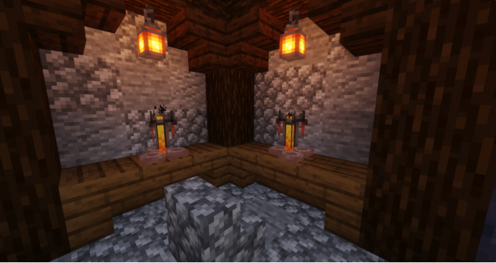
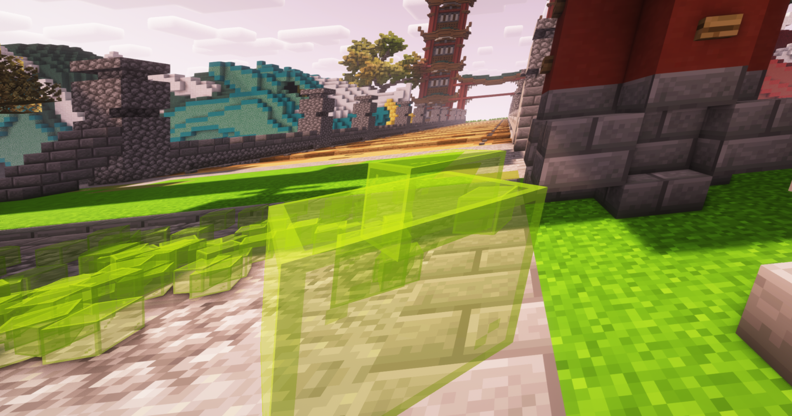

# 🌟 Distilling and Drinking

## **Distilling**

Some Recipes don't require distilling but those that do are known as spirits, distilling is done with a brewing stand

1. Place the bottles with ferment into the brewing stand slots.
2. Place glowstone dust to act as a filter on top into the brewing stand (The glowstone used to filter will not be consumed during the prosses).

<figure><figcaption>
Two brewing stands placed in a brewing area.
</figcaption></figure>

## Drinking

The Amount of Alcohol inside the Brew will be applied to the player when drinking. Depending on the quality of it, that may have different effects.

* The Player may not be able to walk normally anymore, they will weave, making it almost impossible to walk straight
* Effects like Blindness, Confusion, Poison etc. occur
* The Chat will be altered depending on drunkeness, many things players write may be incomprehensible, sometimes it seems senseless
* Is the Alcohol particularly strong, it may have poisonous effects
* After drinking a lot, there is a chance of vomiting
* After Overdrinking the player may faint (Disconnecting)

<figure><figcaption>
The player vomiting up lime stained glass, sounds quite painful to be honest
</figcaption></figure>
