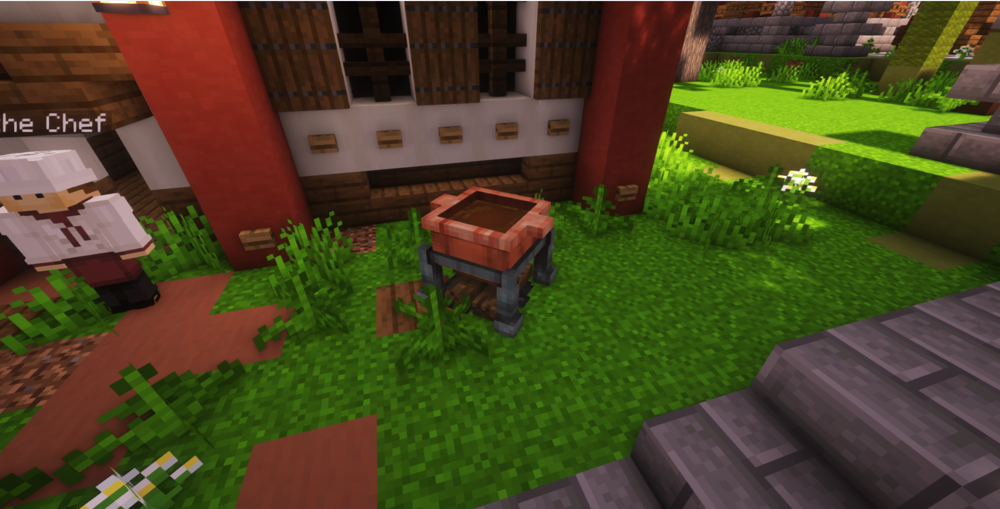
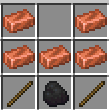

# 🍲 Cooking Pot

## Using the Cooking Pot

Cooking all revolves around the cooking pot, this is the pot that represents how all your future cooking will be done, you can learn more about the pot as well as how to get started with cooking in general by talking to Piandao the Chef at spawn.

When you right click the cooking pot the [recipe book](https://bendingmc.gitbook.io/bendingmc-wiki/cooking/getting-started/recipe-book) will open this recipe book is the collection of all your knowledge of cooking and can be used to cook recipes by left or right clicking the ones you know.

You can light your cooking pot by simply right clicking the pot with a flint and steel

<figure><figcaption>
The unlit cooking pot when placed down into the world
</figcaption></figure>

<figure><figcaption>
The error when you try and cook in an unlit pot
</figcaption></figure>

## Crafting the Cooking Pot

In addition to the cooking pot you get from the Chef during the tutorial quest you can craft an unlimited number of additional cooking pots using the recipe below:

<figure><figcaption>
Crafting the cooking pot with copper ingots, sticks and coal
</figcaption></figure>

