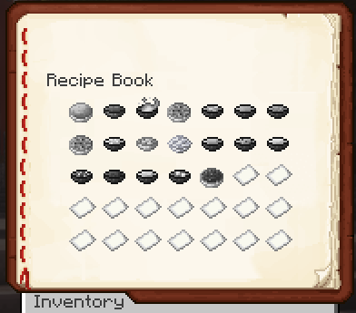

# 📖 Recipe Book

## Using the Recipe Book

The recipe book displays all locked and unlocked recipes.\
Locked recipes will appear in gray, while unlocked recipes appear in full color.

Clicking on any of the unlocked recipes, if all ingredients are provided, will trigger a [minigame](https://bendingmc.gitbook.io/bendingmc-wiki/cooking/getting-started/cooking-dishes#the-cooking-bar).\
After successfully completing the minigame, the selected dish will be cooked.

\[minigame image here]

## Unlocking Recipes

New recipes can be unlocked by collecting recipe scraps.\
Collecting those will unlock a random, unknown recipe.

Recipe scraps can be acquired by fishing, quests, and random loot found throughout the map.

\[recipe scrap image here]

Some special recipes can only be unlocked by defeating certain bosses. See more in the future.

<figure><figcaption>
Recipe book with locked recipes
</figcaption></figure>
