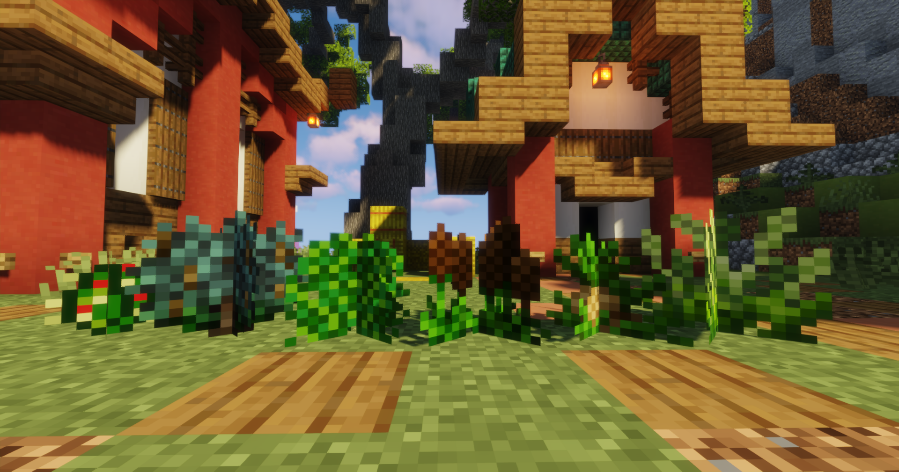
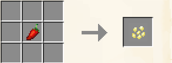

# 🌺 Getting Started

In the context of custom crops, foraging refers to the process of obtaining seeds and natural crops, In the wild there are two main ways: wilderness gardens and seed crafting. More ways will be possible in the future as the system is expanded.

**Wilderness Shrubs**

* \- Wilderness Shrubs are custom plants that grow throughout the world and can be found in a wide variety of biomes, when broken these gardens will randomly drop one crop that grows in that climate.
* \- Shrubs come in six varieties: **Arid, Frosty, Soggy, Shaded, Tropical** and **Windy** distributed throughout the world.
* \- When broken they each drop _one_ crop of the corresponding climate type. These shrubs are found in a selection of biomes based on those area's climates, _Frosty Shrubs_ are found in the cold _Taiga_, _Arid Shrubs_ in the dry _Deserts_ and so forth.

**Seed Crafting**

\- Any crop _(found foraging, bought from other players or harvested from a cultivated plant)_ can be put into a crafting grid to receive one of the corresponding seed type regardless of tier, with a _1:1_ ratio.

<figure><figcaption>
All shrubs from left to right: Arid, Frosty, Shaded, Soggy, Tropical and Windy
</figcaption></figure>

***

<figure><figcaption>
An example of crafting one of any produce item into the corresponding seed.
</figcaption></figure>
