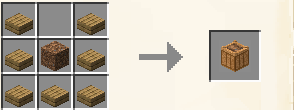
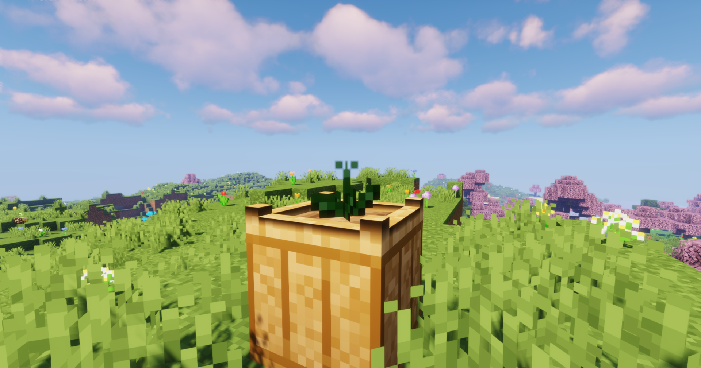
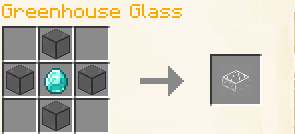
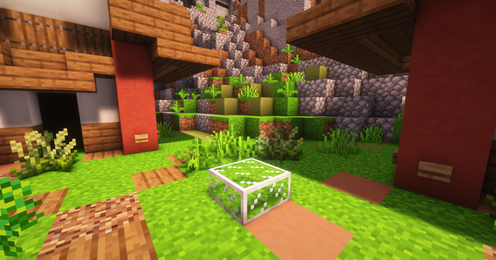

# 🪴 Growing & Seasons

Crops as a system is built to work in tandem with vanilla yet, _unlike what you're used to_, plants grow by **one stage each morning** in-game. However, crops are bound by certain conditions of growth for example: only being able to be grown in certain seasons, all crops are only able to be grown in planting pots, requiring watering and so on. Crops also require exposure to sunlight, (A **sky-light** level of _**eight or higher**_) to grow.\
**Planting Pot**

* The “Planting Pot” is a newly introduced block they are fairly cheap to craft and you will find yourself using a lot of these due to the fact they are the only block in which custom crops can be planted.

<figure><figcaption>
An example of the planting pot recipe, similar to that of the composter.
</figcaption></figure>

## **Seasonal Crops**

A very important aspect of the crops system are the four Seasons, **Winter**, **Spring**, **Summer**, and **Autumn**. - Most crops are seasonally dependant, _this means they are only able to grown certain seasons (usually two or more)_, these planting seasons are based loosely on their real-life counterparts. You are able to grow roughly around the same number of crops in each season with the exception of **winter** where only a total of **six** crops can be grown.\

<figure><figcaption>
An example of a planting pot that contains a stage one plant.
</figcaption></figure>

## Greenhouse Glass

* Another new block introduced is **Greenhouse Glass**, this block is very expensive to craft but allows you to plant **any crop** regardless of season as long as the pot is under the glass, meaning **only one** glass is needed per pot.

<figure><figcaption>
An example of the greenhouse glass recipe, requires one diamond and tinted glass
</figcaption></figure>

<figure><figcaption>
Greenhouse Glass when placed into the world
</figcaption></figure>
