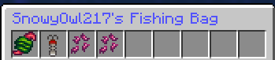

# 🛒 Shipping

Each crop has an assigned value that changes based on statistics about it, these values will change overtime to prevent any one crop becoming the meta as well as to allow freedom of choice for whatever you'd like to grow! The crop value increases substantially as the item's tier increases which incentivises you to produce the best quality crops you can though the use of quality enhancing fertilizers.

## Shipping Bin

The shipping bin is a new block added by the custom crops update. It allows you to place down a shipping bin in your town to sell your produce and rafted goods for profit!                                         &#x20;

<figure><figcaption>
The recipe for the shipping bin
</figcaption></figure>

<figure><figcaption>
How the shipping container looks placed down
</figcaption></figure>

## The Farmer

Your second option when it comes to selling your produce is through the kindly farmer, found a little further into spawn, who will take produce of your hands giving you the same value as would be given with the shipping bin.

There is no benefit to using the farmer over the shipping bin, it is just to reduce the need to travel.
