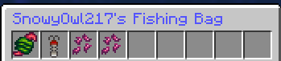

# 📚 Getting Started

So, to start, there are six different sorts of rarities and 71 various types of custom enchants. These unique enchantments include everything from indestructible armour to the power to maintain your possessions after death! There is plenty to learn, so let's start with the fundamentals.

<figure><figcaption>
The Server Enchanting Menu
</figcaption></figure>

Custom enchants can also be found in the enchanting table menu, but they are rarely seen and it is a better solution to use the custom enchants menu.

The six rarities from cheapest to most expensive include, **common**, **uncommon**, **rare**, **very rare**, **legendary**, and **mythic**, with common being the most easiest to get, while mythtic is the hardest, needing 112 levels to purchase 1. Do note that this will consume every level, so get grinding!

Enchants are purchased with experience and not money, and there are varieties for tools and armour, some for combat and some for utility.

<figure><figcaption>
The custom enchantment Haste
</figcaption></figure>

Enchantments are also very unique, and each one you get has a different success rate, even if it is the same enchant. Some also have levels like **Metal Extraction** with three levels. The success rate is the probability of the enchant being applied to your tool, else your tool will get destroyed with the enchant. There are ways to prevent this.

<figure><figcaption></figcaption></figure>

When with the right amount of experience, a random book is purchased from the chosen rarity with a random success and destroy rate. The book is then dragged in the player's inventory and applied to the tool or armour and the success is a gamble, unless scrolls are applied.

_Credit to Max and Finx for helping write the content for this wiki_
