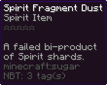

# ⚗ Dust, Alchemist and Tinkerer

An item called **dust** gives you the ability to boost an enchantment's success rates while reducing the probability that it will not succeed.

The tinkerer and useless tinkering books can be used to create dust.

The Tinkerer and the Alchemist can be used to trade and combine enchants to create better ones or to obtain dust in addition to the ability to purchase enchants with experience and apply them on your tools and armour.

**Tinkerer**: The tinkerer is utilised to obtain dust. A single book or a number of books of similar value in the Tinkerer menu. Books are traded for mystery dust packages, which when right clicked has a chance to give you spirit dust.

But this is not always the case. Sometimes received mystery package will give you **spirit fragment dust**, which is useless and cannot be used on books.

<figure><figcaption>
Tinkerer Menu
</figcaption></figure>

**Alchemist**: Enchantments and dust can be combined using the Alchemist menu. It begins with two identically rare dust or enchantments, such as two common or rare items, and is exchanged for either a dust or book of greater rarity. Only two books and two dusts can be combined at once.

But this is not always the case. Sometimes received mystery package will give you spirit fragment dust, which is useless and cannot be used on books.

<figure><figcaption></figcaption></figure>

Alchemist Enchantments and dust can be combined using the Alchemist menu. It begins with two identically rare dust or enchantments, such as two common or rare items, and is exchanged for either a dust or book of greater rarity. Only two books and two dusts can be combined at once.
